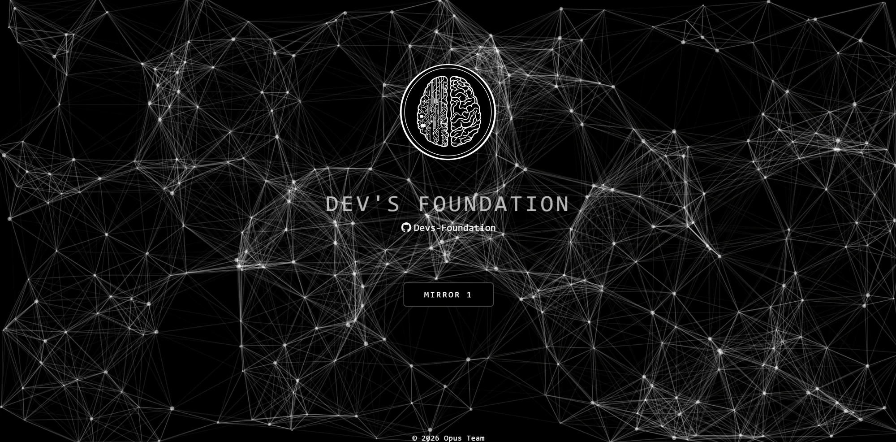

> [English](README.md) · [Português](README.pt.md) · [Español](README.es.md) · [Français](README.fr.md) · 🌐 **Deutsch** · [中文](README.zh.md)

# Dev's Foundation — Website



Die offizielle Website der **Dev's Foundation Methode** — das weltweit erste
**Multi-Agenten-Konsenssystem mit einem gemeinsamen Gehirn**.

**Live:** [devs.foundation](https://devs.foundation/) · **Methode:** [multi-agent-consensus-method](https://github.com/Devs-Foundation/multi-agent-consensus-method)

Dieses Repository ist ein **portabler, in sich geschlossener Spiegel** der Website. Es ist zu 100 %
statisch — kein Build-Schritt, kein serverseitiger Code, keine zu installierenden Abhängigkeiten. Sollte
die Hauptdomain jemals ausfallen, kann dieses Repository in Sekunden geklont und überall gehostet werden.

## Was enthalten ist

| Datei | Zweck |
|------|---------|
| `index.html` | Landingpage (der Plexus-Eingang — identisch mit der Live-Version) |
| `inicio.html` | Die Methoden-Website — Startseite, mit horizontalen Tabs + interaktivem Graphen |
| `problemas · solucoes · mentes · consenso · skills · etica · infra · resiliencia .html` | Eine Seite pro Säule der Methode |
| `app.js` | Die Engine: Inhalte in 6 Sprachen (EN · PT · ES · FR · DE · ZH) + der kraftgerichtete Graph |
| `style.css` | Monochromes Theme (Grau → Schwarz, weißer Text) passend zum Gehirn-Logo |
| `js/particles.js` | Plexus-Animation für die Landingpage |
| `assets/` | Gehirn-Logo, das 7-Tage-Gehirngraph-Bild, Mind Maps je Sprache |

Die `index.html` verlinkt über den **Mirror 1**-Button auf `inicio.html`, genau wie auf der Live-Website.

## Lokal ausführen

Jeder statische Server funktioniert. Zum Beispiel:

```bash
python -m http.server 8000
# dann http://localhost:8000 öffnen
```

## Überall hosten

Da alles vollständig statisch ist, läuft es ohne jegliche Konfiguration auf jedem Host:

- **GitHub Pages** — Settings → Pages → Deploy von `main`. Sofortiger kostenloser Live-Spiegel.
- **Netlify / Vercel / Cloudflare Pages** — Ordner per Drag-and-Drop hochladen, fertig.
- **Beliebiges Web-Root** — Dateien neben einen Webserver kopieren. Pfade sind relativ.

---

© 2026 Dev's Foundation · Die Methode ist öffentlich; der Inhalt ist immer privat.
